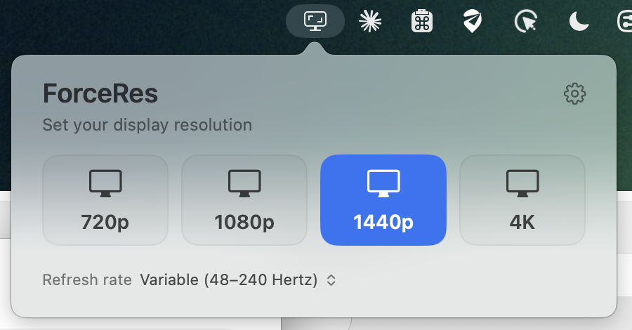

# ForceRes

Force any Mac display to 720p, 1080p, 1440p, or 4K from the menu bar.

**Beta.** It works and it's safe to try — every change reverts itself unless you confirm — but it has only been tested on a handful of displays. Bug reports welcome.



## Install

Download the zip from [Releases](../../releases), unzip it, drag `ForceRes.app` to
Applications. It's signed and notarized, so it opens normally.

## Using it

Click the icon and pick a resolution. Every change gives you 15 seconds to confirm —
click Keep, or do nothing and it reverts. A mode that leaves you staring at a black
screen can't strand you.

Under the gear:

- **Default Resolution** — back to whatever the display was on before ForceRes.
- **Low Resolution (1x)** — presets normally use the HiDPI variant, same as System
  Settings. Turn this on for the true 1x framebuffer (smaller text, fewer pixels to
  render).
- **Launch at Login**

Right-click the menu bar icon for that same menu without opening the panel.

**Aspect Ratio** under the gear switches the four tiles between 16:9 and 16:10. Every
MacBook panel is 16:10, so 16:9 sizes letterbox there; the 16:10 ladder fills the panel.
Picking a shape only relabels the tiles; it never changes the display on its own. Your
choice is remembered per display, and ForceRes opens on the shape you are already using.

**Refresh rate** sits under the presets and applies to whatever resolution is in
effect. It lists only the rates your display actually reports, plus Variable (or
ProMotion on a built-in panel) when there is one.

With more than one display connected, a picker appears above the tiles. The panel opens
aimed at the screen whose menu bar you clicked, so clicking the icon on your second
display adjusts that display.

Quitting puts every display back the way it was. Your picks return next launch.

## Notes

- A preset larger than the panel is greyed out, with the panel's real size as the
  reason. A 1080p display can't show 4K, and faking it by downscaling would only look
  worse.
- Built-in MacBook panels don't expose 16:9 modes to any app. For sizes that do fit the
  panel, ForceRes creates a virtual display and mirrors the panel to it. That path is
  60 Hz and letterboxes on a 16:10 panel.
- If a rate isn't in your display's mode list it won't appear. No 144 Hz timing in the
  EDID means no 144 Hz option.
- Only real displays are listed. AirPlay, Sidecar, DisplayLink and virtual displays
  are skipped — mirroring a panel onto one of those is what takes WindowServer down.
- Not sandboxed, so not on the App Store.

## Requirements

macOS 15 or later, Apple Silicon.

## Building

Needs full Xcode, not just the Command Line Tools.

```sh
swift build
swift test
Scripts/run-checks.sh            # build + tests + symbol checks
Scripts/build-app.sh --version 1.0.0
```

`Scripts/notarize.sh --profile <notarytool-profile>` signs off a release.

Two extra tools come out of the same build: `forceres-probe` dumps every display mode
the system reports (`--json` for a test fixture), and `forceres-dev` applies modes,
mirrors and virtual displays from the terminal with an automatic revert.

`docs/RESEARCH.md` is the working notebook behind all of this — what CoreGraphics
exposes, what it hides, and which private paths crash the window server. Read it
before touching anything in `Sources/ForceResDisplay`.
